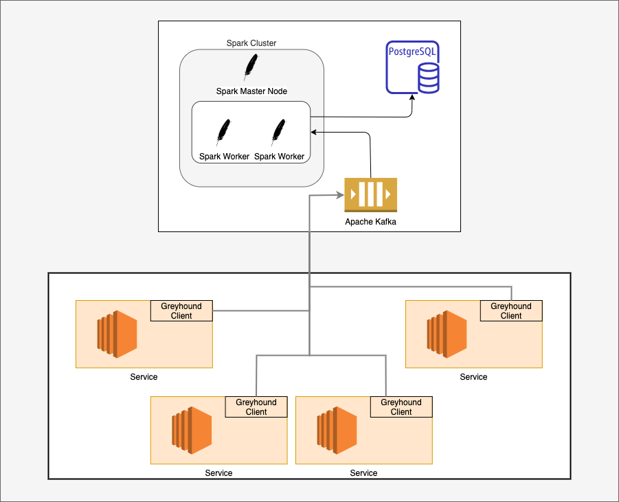

# Greyhound

### A Distributed Tracing Platform using Kafka, Spark Structured Streaming and PostgreSQL
A distributed request tracing system that helps analyze the flow of requests within a microservice system and log all communication along with their timings. A React based interactive UI is deployed to provide visual access to data and to help perform analysis and derive insights.




We use a continuation ID to associate communication belonging to one request flow. The time period between each successful entry and exit of a request into and out of a service is called a span. Each continuation unit can have a tree of span units based on their order and level of execution. 


### Deployment

```bash
cd infra && docker-compose up
cd spark && docker-compose up
cd spark-driver && docker-compose up
```

### Usage
python :
```python
# To add implementation
```

javascript :
```javascript
// To add implementation
```

java :
```java
// To add implementation
```

golang :
```golang
// add implementation
```


